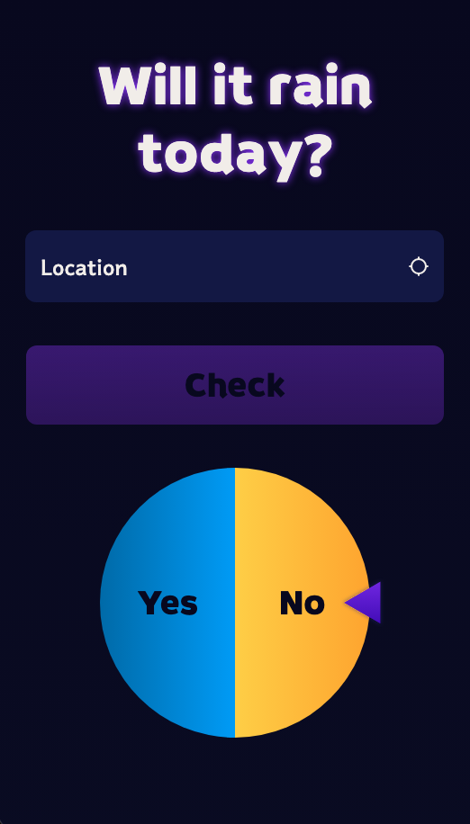
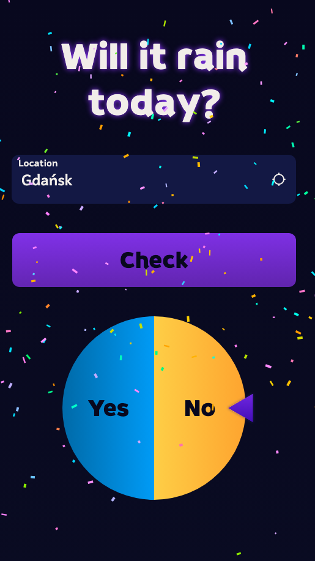

# WillItRain

This project was generated using [Angular CLI](https://github.com/angular/angular-cli) version 21.2.8.

The main purpose of this web app is to check whether it will rain today in a specific location in a fun way. To achieve that, [Weather API](https://app.swaggerhub.com/apis-docs/WeatherAPI.com/WeatherAPI/1.0.2) was used. Browser [Navigator](https://developer.mozilla.org/en-US/docs/Web/API/Navigator/geolocation) was used to access user location as coordinates and [Google Maps package](https://www.npmjs.com/package/@angular/google-maps) made it possible to reverse geocode the coordinates into city name (the Weather API also returns location name, but it often resolves to a district rather than city name).




https://github.com/user-attachments/assets/1ea472a3-f602-4390-9e8b-d26c3edb6a59

## Development server

To start a local development server, run:

```bash
ng serve
```

Once the server is running, open your browser and navigate to `http://localhost:4200/`. The application will automatically reload whenever you modify any of the source files.
